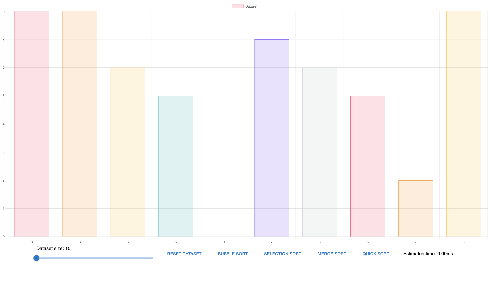
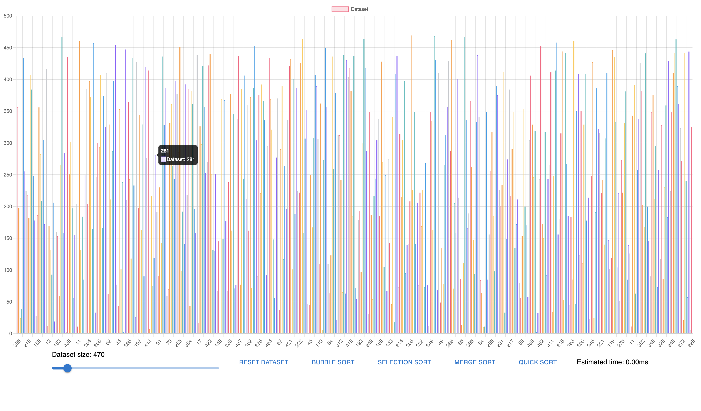
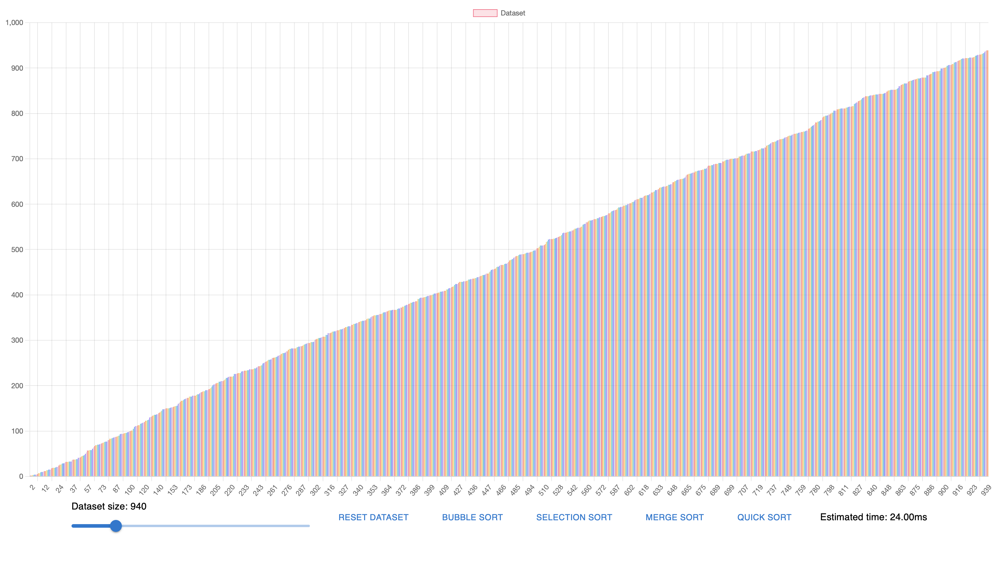

# Sorting algorithms in React

Application: https://szivkovicx.github.io/sorting-algorithms-react/

This is a little project showcasing 4 sorting algorithms used on controllable dataset with estimated time indicator written in Typescript and visualised using React with MaterialUI and ChartJS. Algorithms used:

* Bubble sort
* Selections sort
* Merge sort
* Quick sort

